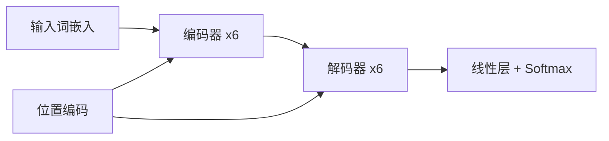

# Attention Is All You Need（测试样例）

> **头条简报**：本文提出 Transformer 架构，完全基于自注意力机制，摒弃循环与卷积，在机器翻译任务上达到 SOTA 且训练更易并行。这是 zotero-digest 的固定测试内容，无需调用 LLM 即可验证 UI 与深链接。

- **作者**：Vaswani Ashish, Shazeer Noam, Parmar Niki
- **出处**：NeurIPS (2017)
- **Zotero 条目**：<zotero://select/library/items/TESTNOTE>

## 摘要

The dominant sequence transduction models are based on complex recurrent or convolutional neural networks that include an encoder and a decoder. The best performing models also connect the encoder and decoder through an attention mechanism. We propose a new simple network architecture, the Transformer, based solely on attention mechanisms, dispensing with recurrence and convolutions entirely.

<!-- zh-abstract -->
主流的序列转换模型基于复杂的循环或卷积神经网络，包含编码器与解码器；表现最好的模型还通过注意力机制连接二者。我们提出一种仅依赖注意力机制、完全摒弃循环与卷积的简洁网络架构 Transformer。
<!-- /zh-abstract -->

## 速览解读

### 核心贡献

Transformer 用多头自注意力（Multi-Head Self-Attention）替代 RNN/CNN 做序列建模，编码器-解码器堆叠即可在 WMT 英德、英法翻译上取得当时最优 BLEU，且训练时间大幅缩短。

### 方法亮点

Scaled Dot-Product Attention 配合位置编码（Positional Encoding）保留词序；Multi-Head 允许模型在不同子空间关注不同关系；残差连接与 LayerNorm 稳定深层训练。

### 为何值得读

它是现代大语言模型（GPT、BERT 等）的共同起点，理解 Transformer 有助于读懂后续预训练、指令微调与 RAG 文献。

## 全文深度解读

*正文来源：fixtures/test_note.md（测试数据，非真实 PDF）*

### 架构概览

Transformer 由编码器栈与解码器栈组成，每层核心是 Self-Attention 与前馈网络（FFN）。整体数据流如下：

### 注意力机制

Query、Key、Value 来自同一序列时即为 Self-Attention。Scaled Dot-Product 公式：

| 符号 | 含义 |
| --- | --- |
| Q | Query 矩阵 |
| K | Key 矩阵 |
| V | Value 矩阵 |
| d_k | Key 维度，用于缩放 |

注意力权重经 Softmax 后与 V 相乘，得到上下文表示。Multi-Head 将上述过程并行执行 h 次再拼接。

### 方法度量表（KaTeX 回归）

| 理论构念 | 代理变量 | 数据来源 | 处理逻辑 |
| --- | --- | --- | --- |
| 注意力复杂度 | Scaled Dot-Product $A_l$ | 每层 QK 乘积 | $d_k^{-1/2}$ 缩放 |
| 几何分离 | 相邻质心距离 $D^{(k)}_l$ | 层激活向量 | 求 $|\mu_{l,k+1}-\mu_{l,k}|_2$ |

### 与 RNN 的对比

RNN 逐步处理序列，难以并行且长程依赖易衰减。Transformer 在固定层数内以 O(n^2) 复杂度建立任意位置间的直接连接，更适合 GPU 批量训练——这也是后续「预训练 + 微调」范式能 scale 的基础。

## 关键术语

- 自注意力[Self-Attention]
- 多头注意力[Multi-Head Attention]
- 位置编码[Positional Encoding]
- 缩放点积注意力[Scaled Dot-Product Attention]
- 编码器-解码器[Encoder-Decoder]

## 快捷入口

- [在 Zotero 中打开条目](zotero://select/library/items/TESTNOTE)
- [打开 PDF](zotero://open-pdf/library/items/TESTPDF1)

---
*生成于 2099-01-01 00:00（测试 fixture，仅供本地验证）*
